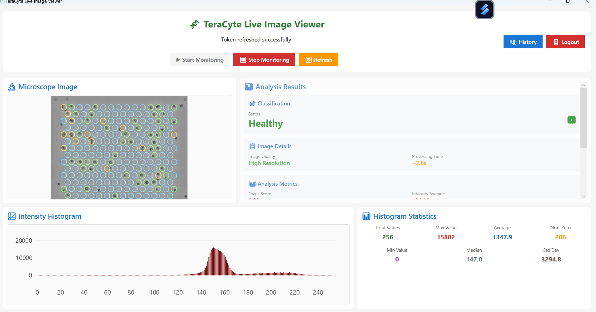
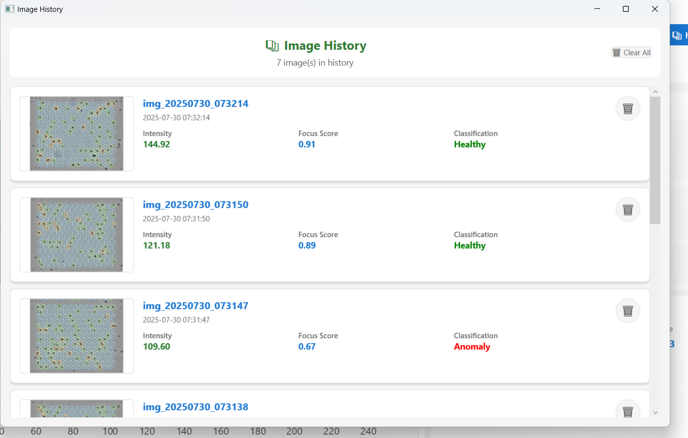
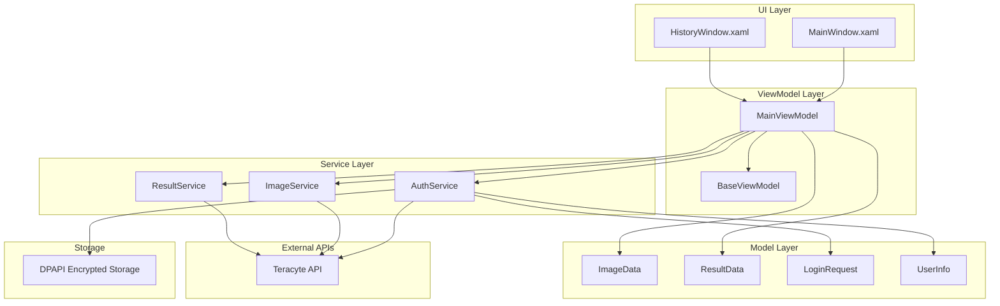
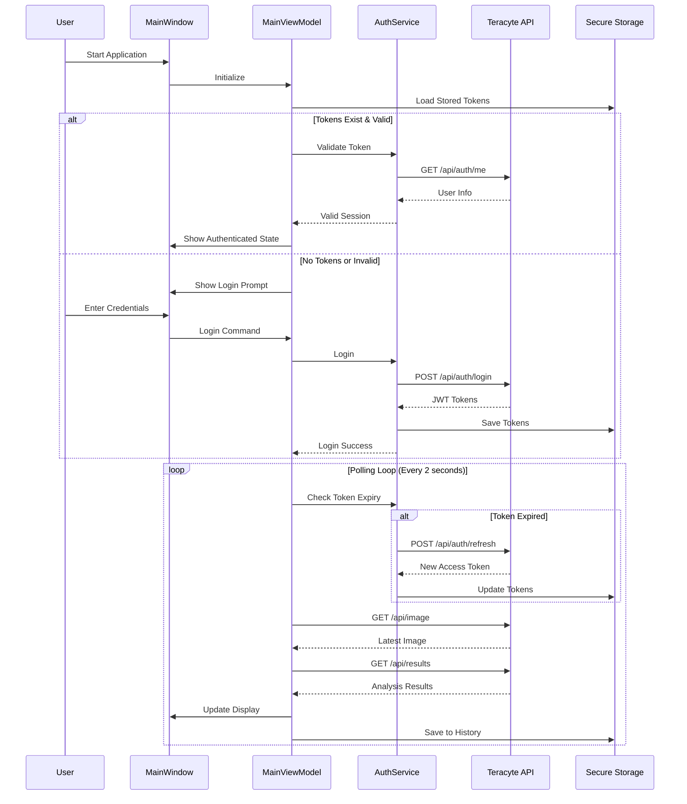

# 🧬 TeraCyte Live Image Viewer

A real-time microscope image analysis application built with .NET 8.0 WPF, featuring live data polling, JWT authentication, and advanced image analysis capabilities.

> **📋 Assignment Project** - This application was developed as part of the TeraCyte home assignment, demonstrating proficiency in .NET WPF development, MVVM architecture, and real-time data processing.

## 📋 Prerequisites

- **.NET 8.0 Runtime** or later
- **Windows 10/11** (required for DPAPI encryption)
- **Internet Connection** (for API communication)

## 🚀 Quick Start

1. **Clone the repository**
   ```bash
   git clone https://github.com/shirzohar/TeraCyteViewer.git
   cd TeraCyteViewer
   ```

2. **Build and run**
   ```bash
   dotnet build
   dotnet run
   ```

3. **Login with test credentials**
   - Username: `shir.zohar`
   - Password: `biotech456`

## 📸 Screenshots

### Main Application Dashboard

*Live image viewer with real-time analysis results, histogram visualization, and comprehensive metrics display*

### Authentication & Login Screen

*Secure JWT authentication with automatic token refresh and session persistence*

### History Management

*Complete image history with individual deletion options and bulk clear functionality*


## 🎯 Features

### 🔐 **Authentication & Security**
- **JWT Token Management**: Secure login with automatic token refresh
- **Encrypted Storage**: Tokens and history encrypted using Windows DPAPI
- **Session Persistence**: Automatic login restoration between sessions
- **User Information**: Display current user details and role
- **Secure Logout**: Complete session cleanup with option to re-login

### 📊 **Real-Time Monitoring**
- **Live Data Polling**: Continuous monitoring of microscope images
- **Smart Change Detection**: Only updates when new images are detected
- **Automatic Reconnection**: Handles network interruptions gracefully
- **Status Indicators**: Real-time connection and processing status

### 🔬 **Image Analysis**
- **Classification Results**: Automatic cell health classification
- **Focus Scoring**: Image quality assessment
- **Intensity Analysis**: Detailed pixel intensity measurements
- **Histogram Visualization**: Live charts with statistical analysis
- **Dynamic Metrics**: Real-time calculation of processing metrics

### 📚 **History Management**
- **Persistent Storage**: History saved between sessions and logins
- **Image Gallery**: Visual history of all analyzed images
- **Individual Deletion**: Remove specific images from history
- **Bulk Operations**: Clear all history with confirmation
- **Encrypted Storage**: History data protected with user-specific encryption

### 🎨 **User Interface**
- **Modern Design**: Clean, professional interface with animations
- **Responsive Layout**: Adapts to different screen sizes
- **Visual Feedback**: Animated indicators for new data
- **Status Updates**: Real-time progress and error reporting
- **Accessibility**: High contrast and clear visual hierarchy

## 🔐 Security Features

### Secure Token Storage
- **Encrypted Storage**: Tokens are encrypted using Windows Data Protection API (DPAPI)
- **User-Specific**: Encryption is tied to the current Windows user account
- **Automatic Persistence**: Tokens are automatically saved and restored between sessions
- **Secure Cleanup**: Tokens are properly cleared on logout

### Authentication Flow
1. **Initial Login**: Authenticate with username/password
2. **Token Storage**: Encrypt and store tokens locally
3. **Session Restoration**: Automatically restore valid tokens on app restart
4. **Token Refresh**: Automatically refresh expired tokens
5. **Secure Logout**: Clear all stored tokens and authentication state

### Data Protection
- **History Encryption**: All history data is encrypted using DPAPI
- **User Isolation**: Data is tied to the current Windows user
- **Secure Deletion**: Proper cleanup of sensitive data
- **No Plain Text**: No sensitive data stored in plain text

## 🏗️ Architecture

### MVVM Structure with Dependency Injection

```
TeraCyteViewer/
├── Models/                 # Data models
│   ├── ImageData.cs       # Image data structure
│   ├── ResultData.cs      # Analysis results
│   ├── LoginRequest.cs    # Authentication request
│   ├── LoginResponse.cs   # Authentication response
│   ├── UserInfo.cs        # User information model
│   └── AuthState.cs       # Authentication state management
├── ViewModels/            # ViewModels (MVVM)
│   ├── BaseViewModel.cs   # Base class with INotifyPropertyChanged
│   ├── MainViewModel.cs   # Main application logic with DI
│   └── RelayCommand.cs    # Command implementation
├── Services/              # Business logic services
│   ├── IAuthService.cs    # Authentication service interface
│   ├── AuthService.cs     # JWT authentication & secure storage
│   ├── IImageService.cs   # Image service interface
│   ├── ImageService.cs    # Image data fetching
│   ├── IResultService.cs  # Result service interface
│   └── ResultService.cs   # Results data fetching
├── Views/                 # UI Views
│   ├── HistoryWindow.xaml # History view with management
│   └── HistoryWindow.xaml.cs
├── Helpers/               # Utility classes
│   └── InverseBooleanToVisibilityConverter.cs
├── logs/                  # Application logs
│   └── teracyte.log       # Debug and error logging
├── screenshots/           # Application screenshots
│   ├── dashboard.png      # Main interface
│   ├── before login .png  # Login screen
│   ├── History.png        # History window
│   └── demo.mp4           # Demo video
├── App.xaml               # Application entry point
├── App.xaml.cs            # DI container configuration
├── MainWindow.xaml        # Main application window
├── MainWindow.xaml.cs     # Window with DI service resolution
├── TeraCyteViewer.csproj  # Project file
├── TeraCyteViewer.csproj.user  # User-specific project settings
├── AssemblyInfo.cs        # Assembly metadata
└── README.md              # Project documentation
```

### Dependency Injection Configuration

**Service Registration (App.xaml.cs):**
```csharp
private void ConfigureServices(IServiceCollection services)
{
    // Register services with interfaces
    services.AddSingleton<IAuthService, AuthService>();
    services.AddTransient<IImageService, ImageService>();
    services.AddTransient<IResultService, ResultService>();
    
    // Register ViewModels with constructor injection
    services.AddTransient<MainViewModel>();
}
```

**Constructor Injection (MainViewModel):**
```csharp
public MainViewModel(IAuthService authService, IImageService imageService, IResultService resultService)
{
    _authService = authService;
    _imageService = imageService;
    _resultService = resultService;
}
```

### Data Flow

1. **Application Startup** → DI container configured in `App.xaml.cs`
2. **Service Resolution** → Services resolved via `ServiceProvider`
3. **Authentication** → `IAuthService` handles JWT login and refresh
4. **Data Polling** → `IImageService` and `IResultService` fetch data
5. **UI Updates** → `MainViewModel` updates properties via data binding
6. **User Interaction** → Commands trigger actions in ViewModel
7. **Data Persistence** → Secure storage of tokens and history

### Architecture Diagrams

**Component Architecture:**


**Authentication & Data Flow:**


## 🎮 Usage

### Main Controls

- **🔑 Login** - Authenticate with the TeraCyte server
- **▶️ Start Monitoring** - Begin real-time data polling
- **⏹️ Stop Monitoring** - Stop data polling
- **🔄 Refresh** - Manually fetch latest data
- **📚 History** - View and manage previously seen images
- **🚪 Logout** - Securely end session and clear tokens

### Authentication States

**Not Authenticated:**
- Login button visible
- Monitoring controls disabled
- "Please login to start monitoring" message

**Authenticated:**
- User info displayed
- History and Logout buttons visible
- Full monitoring capabilities available

### History Management

**Viewing History:**
- Click "📚 History" to open history window
- Browse through all analyzed images
- View classification results and timestamps

**Managing History:**
- Delete individual images with confirmation
- Clear all history with bulk operation
- History persists between sessions and logins

## 📡 API Endpoints

The application uses the following TeraCyte API endpoints:

- **POST /api/auth/login** - User authentication
- **POST /api/auth/refresh** - Token refresh
- **GET /api/auth/me** - Current user information
- **GET /api/image** - Latest microscope image
- **GET /api/results** - Analysis results for current image

## 🔧 Technical Details

### Dependencies
- **.NET 8.0** - Modern .NET framework
- **WPF** - Windows Presentation Foundation
- **Microsoft.Extensions.DependencyInjection** - DI container
- **LiveCharts** - Real-time data visualization
- **Newtonsoft.Json** - JSON serialization
- **HttpClient** - HTTP communication

### Architecture Patterns

**MVVM (Model-View-ViewModel):**
- **Models**: Pure data structures with no business logic
- **ViewModels**: Business logic and data binding with DI
- **Views**: UI presentation only, no business logic
- **Services**: External communication and data processing

**Dependency Injection:**
- **Interface-based design** for loose coupling
- **Constructor injection** for dependencies
- **Service lifetime management** (Singleton/Transient)
- **Testable architecture** with mock services

**Security Implementation:**
- **DPAPI Encryption** - Windows Data Protection API
- **JWT Tokens** - JSON Web Token authentication
- **User-Specific Keys** - Encryption tied to Windows user
- **Secure Storage** - Local encrypted file storage

### Performance Features
- **Async Operations** - Non-blocking UI operations
- **Smart Polling** - Efficient data fetching
- **Memory Management** - Automatic cleanup of old data
- **Error Recovery** - Robust error handling and retry logic
- **Infinity Value Handling** - JSON parsing workaround for server issues

---

## 👨‍💻 Author

**Shir Zohar** - TeraCyte Home Assignment
- **GitHub**: [shirzohar/TeraCyteViewer](https://github.com/shirzohar/TeraCyteViewer)
- **Technology Stack**: .NET 8.0, WPF, MVVM, LiveCharts
- **Assignment**: TeraCyte Live Image Viewer

---
